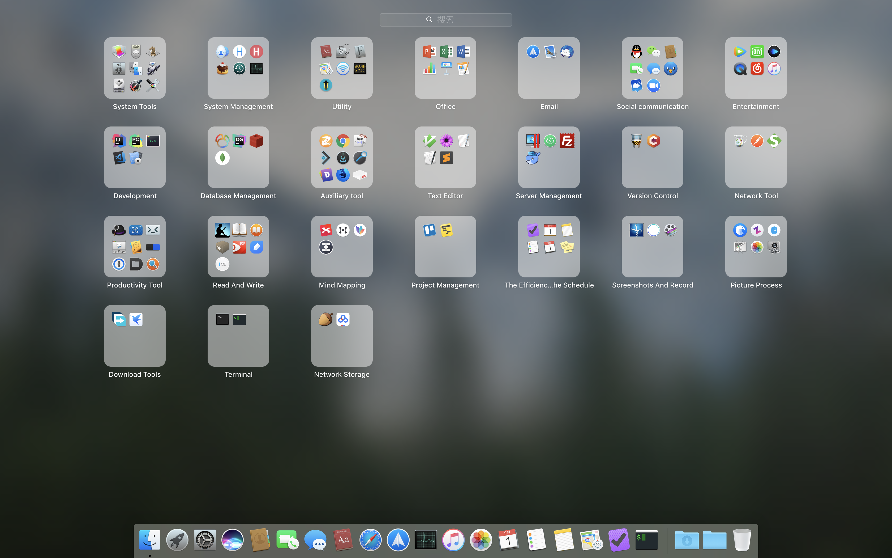

# My awesome mac os

> 列举在日常工作、生活中使用到的应用，包括应用的配置和使用方法，不包含mac os 自带的应用

## 目录

* 应用
    * 系统工具
    * 系统管理
    * 系统实用工具
    * 办公软件
    * 邮件
    * 社交通讯
    * 影音娱乐
    * 开发工具
    * 开发辅助工具
    * 数据库管理
    * 文本编辑
    * 服务器管理
    * 版本控制
    * 网络工具
    * 生产力工具
    * 阅读写作
    * 思维脑图
    * 项目管理
    * 效率日程
    * 截图录屏
    * 图片处理
    * 下载工具
    * 网络存储

* 命令行工具
    * readline
    * wget
    * ccat
    * wifi-password
    * httpie
    * git
    * m-cli

## 应用

### 系统工具

> 包含Mac OS 系统自带的APP

### 系统管理

#### iStat Menus

#### Bartender 3

#### CLeanMyMac 3

#### Gemini 2

#### iHosts

#### SwitchHosts!

#### Cakebrew

### 系统实用工具

#### Lantern

#### BetterZip

### 办公软件

#### Microsoft PowerPoint

#### Microsoft Word

#### Microsoft Excel

### 邮件

#### Spark

#### Thunderbird

### 社交通信

#### QQ

#### 微信

#### Tweetbot

#### Maipo

### 影音娱乐

#### 腾讯视频

#### 爱奇艺

#### IINA

#### 网易云音乐

### 开发工具

#### Intellij IDEA

#### PyCharm

#### 微信开发者工具

#### Visual Studio Code

#### CodeRunner

### 开发辅助工具

#### TextLab

#### Google Chrome

#### Reggy

#### DiffMerge

#### SnippetsLab

#### Understand

#### Dash

#### Firefox Developer Edition

#### ndm

### 数据库管理工具

#### DataGrip

#### Medis

#### MongoDB Compass

### 文本编辑

#### Macvim

#### Textmate

#### Sublime Text 3

### 服务器管理

#### Parallels Desktop

#### Termius

#### Filezilla

#### Docker

### 版本控制

#### Tower

#### Cornerstone

### 网络工具

#### Postman

#### SoapUI

### 生产力工具

#### Alfred 3

#### CmdTab

#### Go2Shell

#### Moom

#### Timing

#### Popclip

#### 1Password

#### Default Folder X

#### iTerm

### 阅读写作

#### Kindle

#### BookReader

#### Reeder

#### PDF Expert

#### 有道云笔记

#### MarkEditor

### 思维脑图

#### 幕布

#### MindMater

### 项目管理

#### Trello

#### OmniPlan

### 效率日程

#### OmniFocus

#### Fantastical 2

### 截图录屏

#### Snip

#### Kap

#### ScreenFlow

### 图片处理

#### Eagle

#### Zoommy

#### IconJar

### 下载工具

#### Free Download Manager

#### 迅雷

### 网络存储

#### 坚果云

#### 百度网盘

