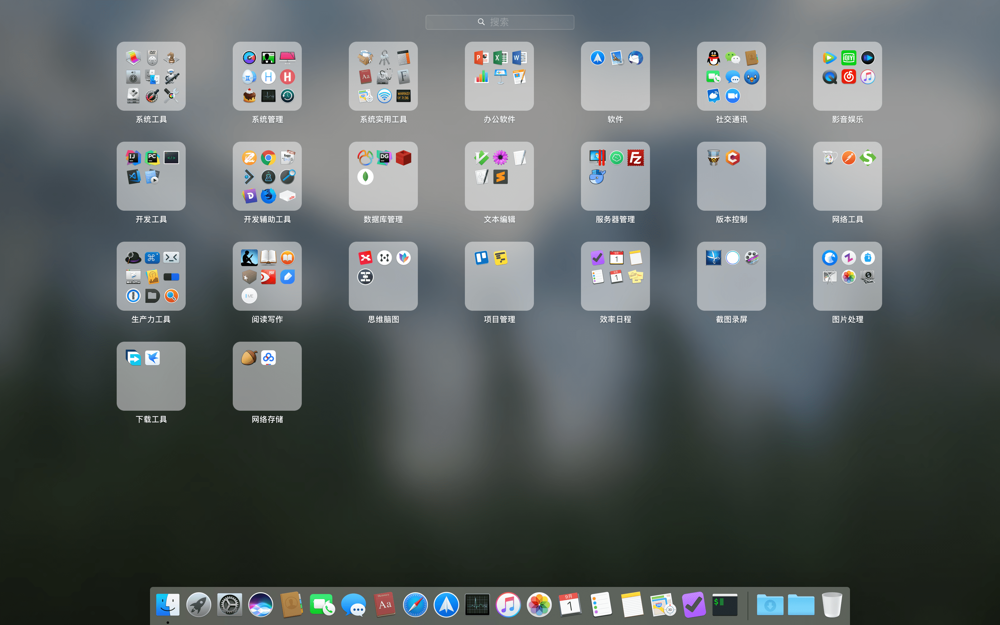

# My awesome mac os

> 列举日常工作、生活使用到的应用，以及这些应用的配置和使用方法

## 目录

* 应用

    * 系统管理工具
    * 实用工具
    * 办公软件
    * 邮件
    * 社交通讯
    * 影音娱乐
    * 开发工具
    * 开发辅助工具
    * 数据库管理
    * 文本编辑
    * 服务器管理
    * 版本控制
    * 网络工具
    * 阅读和写作
    * 思维导图
    * 网络存储
    * 项目管理
    * 效率日程
    * 截图录屏
    * 下载工具
    * Hosts编辑
    * 包管理工具
    * 生产力工具
    * 图像处理

## 应用

